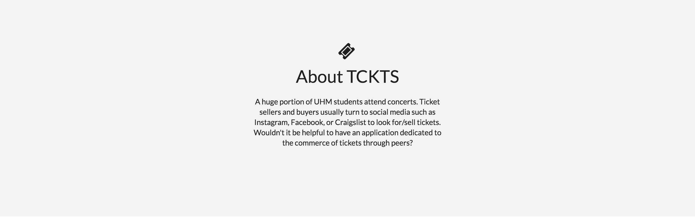
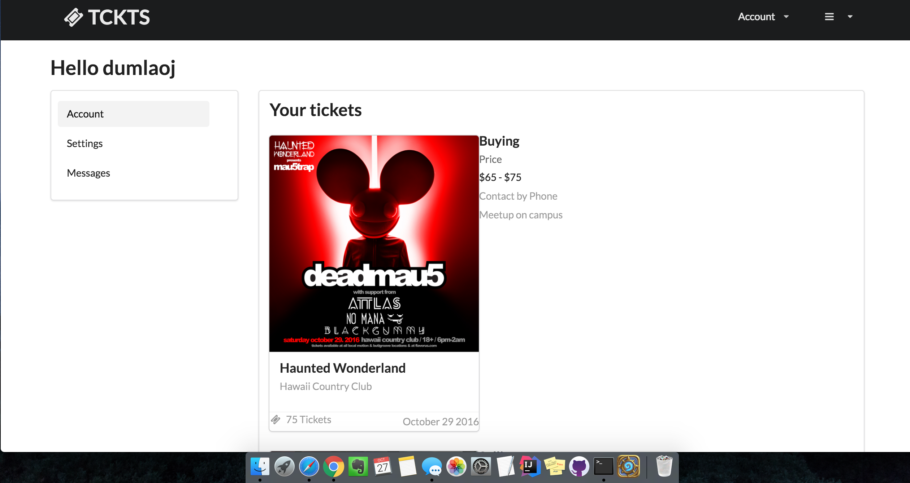
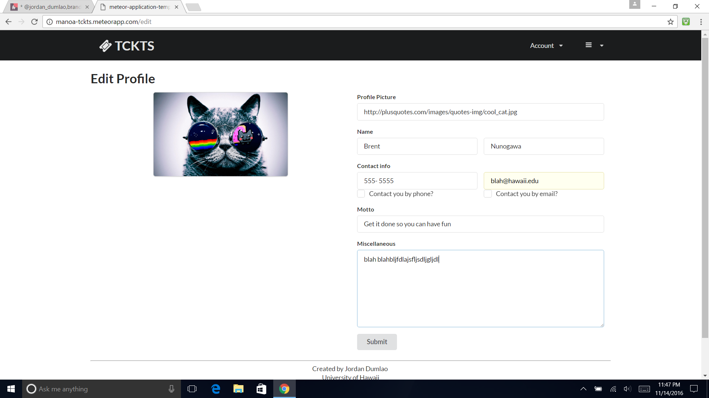
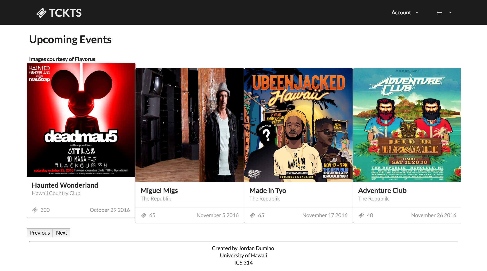
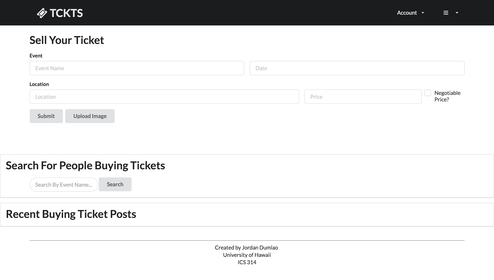

#About Manoa TCKTS

**The problem**: A huge portion of UHM students attend concerts. But the only way to purchase tickets to these events are usually through ticket vendors such as the Campus Center Ticketing Office, or through online websites such as Flavorus. These means of purchasing tickets usually come with a service fee which raises the prices of already difficult to afford tickets. Therefore, students look for ways to purchase tickets at a better price or without service fees through peers. Additionally, students that officially sell tickets for events want to let people know that they are promoting for a particular event or company. Ticket sellers and buyers usually turn to social media such as Instagram, Facebook, or Craigslist to look for/sell tickets. Wouldn't it be helpful to have an application dedicated to the commerce of tickets through peers? 

**The solution**: The ticket exchange app allows students to advertise that they are looking for or selling tickets for common concert events in Hawaii. While similar to Craigslist, the app will focus more on the following features: 

1. Students must login with their UH credentials to access the system.
2. There is no anonymity: buyers and sellers connect through their UH credentials.
3. Transactions can be made off campus but it is preferred to be on campus. This can be specified in each post.
4. Because this app is only for UHM students, concert tickets will be limited to concert events on Oahu only.
5. Students who violate the terms of use for the system can be banned by locking out their UH ID.

#Current Screenshots

* Public landing page

* User home page

* Edit Profile page

* Events page

* Post Sell ticket page

#Functionalities in progress
* A page for a single event
* View profile pages
* Admin Privileges
* Promoter status
* More to come

#Additional functionalities for future versions

* Implement proximity locations so that users can find people near them to make transactions. 
* Allow users to write reviews for other users on things such as legitimacy, how well the transaction went, if they violated any terms and/or if they should be banned, etc. 
* Use something similar to Uber where there are notifications as to where the buyer/seller is in relation to each other.
* Messaging system for users to communicate with each other.
* Previews of the events such as sound clips or movie clips.
