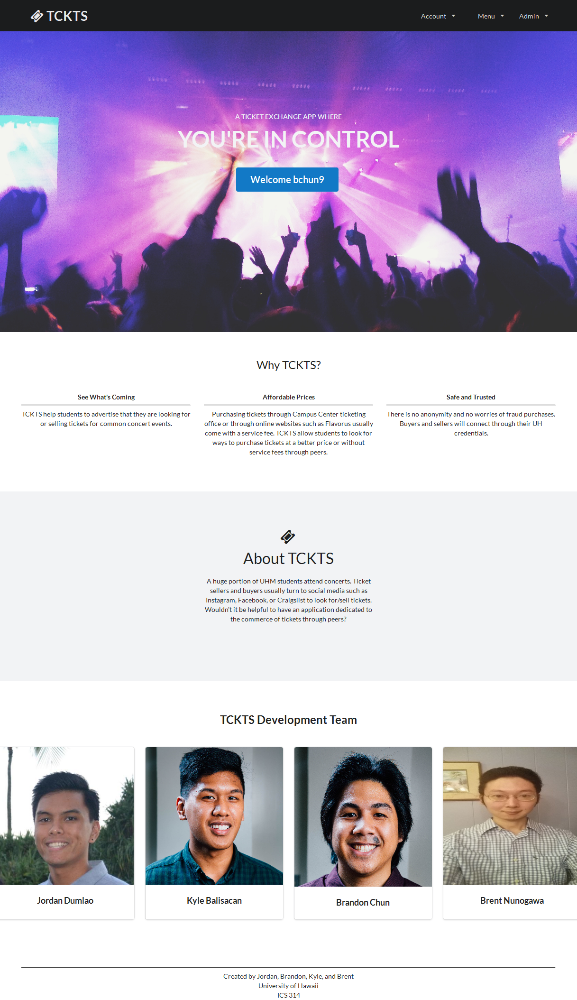
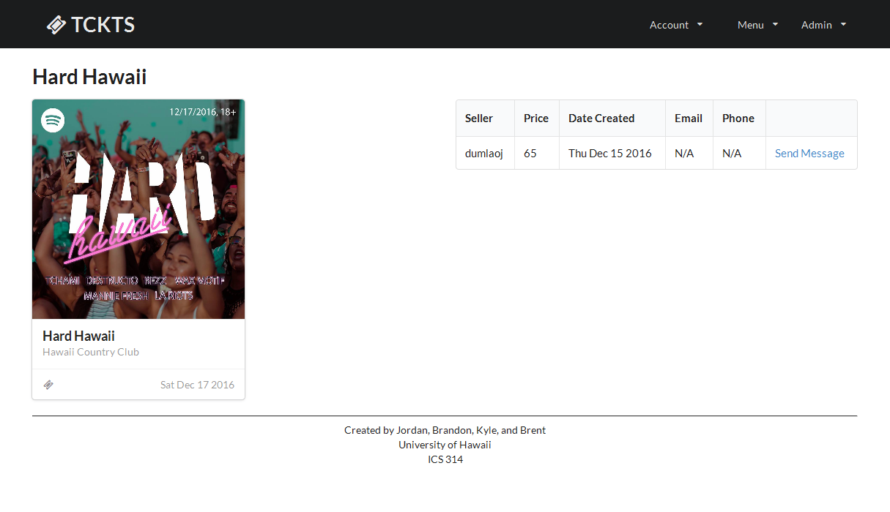

#Click Here: http://manoa-tckts.meteorapp.com

#About Manoa TCKTS

**The Problem**: A huge portion of UHM students attend concerts. But the only way to purchase tickets to these events are usually through ticket vendors such as the Campus Center Ticketing Office, or through online websites such as Flavorus. These means of purchasing tickets usually come with a service fee which raises the prices of already difficult to afford tickets. Therefore, students look for ways to purchase tickets at a better price or without service fees through peers. Additionally, students that officially sell tickets for events want to let people know that they are promoting for a particular event or company. Ticket sellers and buyers usually turn to social media such as Instagram, Facebook, or Craigslist to look for/sell tickets. Wouldn't it be helpful to have an application dedicated to the commerce of tickets through peers? 

**The Solution**: The ticket exchange app allows students to advertise that they are looking for or selling tickets for common concert events in Hawaii. While similar to Craigslist, the app will focus more on the following features: 

1. Students must login with their UH credentials to access the system.
2. There is no anonymity: buyers and sellers connect through their UH credentials.
3. Transactions can be made off campus but it is preferred to be on campus. This can be specified in each post.
4. Because this app is only for UHM students, concert tickets will be limited to concert events on Oahu only.
5. Students who violate the terms of use for the system can be banned by locking out their UH ID.

#Guided Tour

##Public Landing Page:
###Users are able to login using their UH Username and password. As well as read up on some information on Manoa TCKTS and what it's about.

  
###This is an example of what the CAS Login Page looks like:

  

##Edit Profile Page:
###Upon a user's first ever login to the app, it will redirect them to the Edit Profile Page.
###Any future logins to the app will redirect them to their created Profile Page

  

##User Home Page:
###This is the User Home Page that the user gets redirected to every time they login after their first time visiting. On this page, the user can view their information as well as delete any tickets they have posted. The user is also able to view any messages that get sent to them by other users.
 
##TAKE NOTICE
###In order for others to be able to contact a user to buy a ticket they are selling, the seller must have the "Email Checked" or "Phone Checked" on their Profile Page.

  
##Events Page:
###From this page users are able to browse through the upcoming events on Oahu. Users can click on one of the events and it takes them to that specific event page.

 
##Single Event page
###This page displays the event information as well as the tickets that are currently being sold by other users. The information on how to contact a ticket seller is also listed here. There is also the option to send a message directly to the seller.

  
##Sell Ticket Page
###On this page users are able to post their tickets to sell.

##Adminitrator Features
###* Ban Users and Appoint other Administrators

  
###* Add Events to the Events Page
###* Delete Events from the Events Page

#Developer's Guide

* Meteor is required.

* Create a new directory.

* Use git clone to clone the repository into that directory:

  **git clone https://github.com/manoa-tckts/manoa-tckts.git**
  
* Go to the new directory that you created and navigate to the /app directory.

* Once in the /app directory, you will have to run:
     **meteor npm install**
    
* To locally host the application, run this while you are still in the /app directory:
     **meteor --settings ../config/settings.development.json**

* You can now open any browser and go to localhost:3000 to view the application.

#Milestones
<a href="https://github.com/manoa-tckts/manoa-tckts/projects/1"> Milestone 1</a>
 
<a href="https://github.com/manoa-tckts/manoa-tckts/projects/2"> Milestone 2</a>
 
<a href="https://github.com/manoa-tckts/manoa-tckts/projects/3"> Milestone 3</a>
 

#Initial User Study
We have surveyed 5 students to test our app. They have provided us with feedback on the functionality of our app. Both things that were great about it, and things that needed improvements
 These users were monitored by us as they walked through the site with questions

##Overall Experience

 *  The images looked nice
 *  Layout of pages were nice
 *  It was cool to post a ticket and to see what other tickets were posted
 *  The organization of the different events was nice
 *  Impressive to login with UH username
 *  Cards for events could have been padded better
 *  images for events could be bigger
 *  It was cool to have admins role
 *  It might be better to user another type of popup or a prettier popup (modal)

##Events Page

  *  Structure of events was nice
  *  It was nice to click on one event and leads to another page
  *  There is not much infromation on one event besides the tickets being sold, location
  *  Some images looked too small/too big

##Profile Page

  *  It was nice to have information and tickets being displayed
  *  Side bar was clickable
  *  What do we do with motto and misc?
  *  Tickets are deletable

##Sell Ticket Page

  *  Dropdown menu for tickets were nice
  *  Page was kind of bland since all there was was an event name and a price
  *  I liked that it took me back to profile page

##Admin priviliges

  *  It was cool to be able to ban users
  *  It was cool to be able to create and remove events
  *  There could be issues in removing events when ticket exchanges are being done
  *  Not able to edit existing events?
  *  How do people contact the admins?

##Messaging

  *  Cool feature
  *  Impressive to see that popup message description
  *  Pages seem kind of bland, lots of white space on inbox and message page
  *  Can we message other people?
  *  How do I message a specific user?
