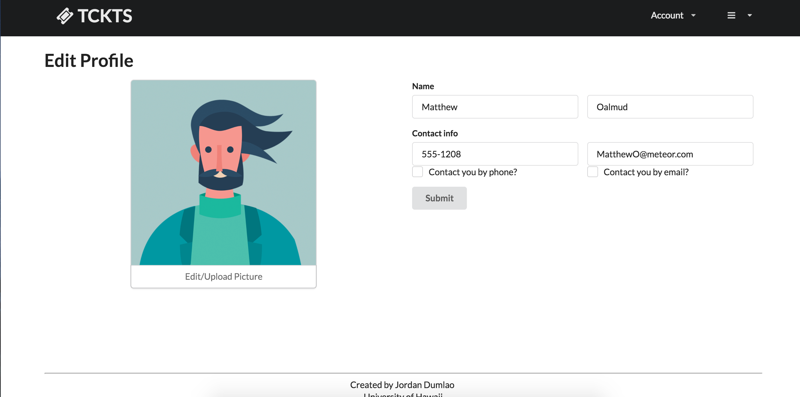

**The problem**: A huge portion of UHM students attend concerts. But the only way to purchase tickets to these events are usually through ticket vendors such as the Campus Center ticketing office or through online websites such as Flavorus. These means of purchasing tickets usually come with a service fee which raises the prices of already difficult to afford tickets. Therefore, students look for ways to purchase tickets at a better price or without service fees through peers. Additionally, students that officially sell tickets for events want to let people know that they are promoting for a particular event or company. Ticket sellers and buyers usually turn to social media such as Instagram or Facebook or Craigslist to look for/sell tickets. Wouldn't it be helpful to have an application dedicated to the commerce of tickets through peers? 

**The solution**: The ticket exchange app allows students to advertise that they are looking for or selling tickets for common concert events in Hawaii. While similar to Craigslist, the app will focus more on the following features: 

1. Students must login with their UH credentials to access the system.
2. There is no anonymity: buyers and sellers connect through their UH credentials.
3. Transactions can be made off campus but it is preferred to be on campus. This can be specified in each post
4. Because this app is only for UHM students, concert tickets will be limited to concert events on Oahu only
5. Students who violate the terms of use for the system can be banned by locking out their UH ID.

**The following are possible functionalities of this application:**

* Roles: There are three roles in the system: 
* Normal - buyer/seller. Can make posts for buying and selling tickets
* Promoter - someone who is an official distributer of tickets for an event or company, This status can be authenticated by Admins(see below) to confirm the legitimacy of promoters. Promoters can provide the amount of tickets that they currently have available to them.
* Admin - Administrators are special users who have the ability to monitor the behavior of users in the system, ban users who violate the conditions for use of the system, and create new categories and other functionality. Admins can also appoint users as promoters by checking the legitimacy of promoters. 
* Events: A page can be displayed that shows all upcoming events. UH campus center has a list of upcoming events which can be used as a basis of possible events. 
* Values: Ticket sellers can provide face values for the tickets, how much they are willing to sell the ticket for, if prices are negotiable, etc. An advanced implementation can be the percentage of discount that the seller is selling the ticket when compared to online or store prices 
* A face value pertains to what it is being sold at at online stores or official stores. These may also include service fees. Sellers of tickets usually sell their tickets for prices lower than face value. A feature can be implemented such that a percentage of the seller's price when compared to the face value price is displayed. 
* Notifications: By default, communication occurs via UH email, but students can also elect to receive information via text message. To do this, they must specify both their mobile phone number as well as their provider (i.e. Verizon, AT&T). Most providers have an “SMS gateway” mechanism that will enable your app to generate a text message to them. 
* Alerts: Users can set up alerts, for example if they are looking for a ticket for a specific event. Then they are automatically notified when that item is listed for sale.
* Photos: Sellers of tickets should provide photos to ensure the legitimacy of the tickets. 
* Upon first login, all users must agree to Terms of Use before they obtain access to the system.
* Profiles: Users have profiles which provide optional information such as further means of contact: instagram, facebook, twitter, email, phone. 

**Mockup page ideas**

Some possible mockup pages include:

* Public landing page

* User home page

* Edit Profile page

* Events page

* Post Sell ticket page

* Admin home page
* Login page
* Post Buy ticket page
* Notify admin page
* Promoters page

**Use case ideas**

* New user goes to landing page, logs in, gets home page, sets up profile.
* Admin goes to landing page, logs in, gets home page, edits site.
* User goes to landing page, logs in, looks for tickets, sets up notification.
* User logs in, lists tickets to sell.
* User tries to buy tickets.
* User and admin interact to ban inappropriate usage.

**Additional functionalities for future versions**

* Implement proximity locations so that users can find people near them to make transactions. 
* Users can write reviews for other users on things such as legitimacy, how well the transaction went, if they violated any terms and if they should be banned, etc. 
* Use something similar to Uber where there are notifications as to where the buyer/seller is in relation to each other
* Messaging system for users to communicate with each other
* Previews of the events such as sound clips or movie clips
